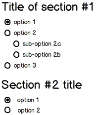

# Acolyte/Anorm 10 minutes tutorial

This tutorial is about how to use [Acolyte](http://cchantep.github.io/acolyte/) and [specs2](http://etorreborre.github.io/specs2/) to test project using [Anorm](http://www.playframework.com/documentation/2.2.x/ScalaAnorm).

[](http://travis-ci.org/cchantep/acolyte)

## Requirements

In order to test this tutorial, you will need:

- [GIT client](http://git-scm.com/downloads), to get sources,
- Java 1.6+,
- [SBT](http://www.scala-sbt.org/), to build it.

## For the impatient: go to sources

If you want to look at tutorial sources -- right now --, you can clone this project:

```shell
# git clone git@github.com:cchantep/acolyte.git --branch 10m-anorm-tutorial
```

Then to run tests using Acolyte against provided Anorm use cases:

```shell
# cd acolyte
# sbt test
```

## Tutorial scenario

This documentation will describe an example where Acolyte is useful.

Consider you want to manage following kind of form, to load it from database:



There are 3 types of form item:

- section title (e.g. "Title of section #1"),
- available options, inside section,
- sub-options, linked to/depending on parent option.

We represent it in Scala with (see [model.scala](./src/main/scala/model.scala) in sources):

```scala
/** Form definition */
case class Form(sections: List[Section])

/** Form section with a title and available options. */
case class Section(title: String, options: List[SectionOption] = Nil)

/** Option available in a form section */
case class SectionOption(label: String, suboptions: List[SubOption] = Nil)

/** Sub-option */
case class SubOption(label: String)
```

In database, it's stored with a table `form_tbl` having columns like:

- `id` (primary key), unique id,
- `level` (discriminator), type/level of information (1 for section title, 2 for option, 3 for sub-option),
- `label`, title or option label.

Persistence function to load form, using Anorm, will be defined as:

```scala
/** Returns either error message, or form if there is data. */
def form(implicit con: java.sql.Connection): Either[String,Option[Form]] = ...
```

Implementation won't be a simple row mapping, one after other.
A more complete parsing is required, to gather sub-options within options, options in sections and finally sections in form (see [Persistence.scala](./src/main/scala/Persistence.scala)).

Moreover while loading form, parse errors can be encountered:

- Form data is not started with a section row (e.g. section option or sub-option).
- Row after a section one is not an option (e.g. sub-option).

In such situation, testing is valuable, to ensure implementation works as expected in the different cases, and that later there won't be regression.

Those cases (shown [mockup](./documentation/images/mockup.png)) are be described with following examples (row for `form_tbl`, there in JSON syntax):

```javascript
[
  { 'id': "section-1", 'level': 1, 'label': "Title of section #1" },
  { 'id': "s1-opt1", 'level': 2, 'label', "option 1" },
  { 'id': "s1-opt2", 'level': 2, 'label', "option 2" },
  { 'id': "s1-opt2a", 'level': 3, 'label', "sub-option 2a" },
  { 'id': "s1-opt2b", 'level': 3, 'label', "sub-option 2b" },
  { 'id': "s1-opt3", 'level': 2, 'label', "option 3" },
  { 'id': "section-2", 'level': 1, 'label': "Section #2 title" },
  { 'id': "s2-opt1", 'level': 2, 'label', "option 1" },
  { 'id': "s2-opt2", 'level': 2, 'label', "option 2" }
]
```

Using Acolyte, it can be encoded so that tests/specifications can be executed without database or complex fixtures management:

```scala
val formTable = rowList3( // Table schema
  classOf[String] -> "id",
  classOf[Int] -> "level",
  classOf[String] -> "label")

val formFixtures = formTable
  .append("section-1", 1, "Title of section #1") // Append rows
  .append("s1-opt1", 2, "option 1")
  .append("s1-opt2", 2, "option 2")
  .append("s1-opt2a", 3, "sub-option 2a")
  .append("s1-opt2b", 3, "sub-option 2b")
  .append("s1-opt3", 2, "option 3")
  .append("section-2", 1, "Section #2 title")
  .append("s2-opt1", 2, "option 1")
  .append("s2-opt2", 2, "option 2")
```

Expected form which gather those cases is:

```scala
val expectedForm = Form(sections = List(
  Section(title = "Title of section #1",
    options = List(
      FormOption("option 1"),
      FormOption("option 2", List(
        FormOption("sub-option 2a"),
        FormOption("sub-option 2b"))),
      FormOption("option 3"))),
  Section(title = "Section #2 title",
    options = List(
      FormOption("option 1"), 
      FormOption("option 2")))))
```

From there, executable form specifications can be written ([PersistenceSpec.scala](./src/test/scala/PersistenceSpec.scala)):

```scala
"Form" should {
  "not be found if data is missing" in withResult(QueryResult.Nil) {
    // Acolyte pushes empty form data into used JDBC connection
    implicit con ⇒ Persistence.form aka "loaded form" must beRight(None)
  }

  "be successfully loaded from valid data" in withResult(formFixtures) {
    implicit con ⇒
      Persistence.form aka "loaded form" must beRight(Some(expectedForm))
  }
}
```

Finally, for wrong sequence of rows (see previous description of error cases, e.g. section started by a sub-option) specifications are:

```scala
"Form error" should {
  "be detected when first row is an option" in withResult(
    // Inject a single option row
    formTable :+ ("opt", 2, "option")) { implicit con ⇒
      Persistence.form must beLeft { err: String ⇒
        err aka "error" must startWith("Unexpected item: SectionOption")
      }
    }

  "be detected when first row is a sub-option" in withResult(
    // Inject a single sub-option row
    formTable :+ ("sub", 3, "sub-option")) { implicit con ⇒
      Persistence.form must beLeft { err: String ⇒
        err aka "error" must startWith("Unexpected item: SubOption")
      }
    }

  "be detected when first row of section is a sub-option" in withResult(
    // Inject section row followed by a sub-option one
    formTable :+ ("sec", 1, "section") :+ ("sub", 3, "sub-option")) {
      implicit con ⇒
        Persistence.form must beLeft { err: String ⇒
          err aka "error" must startWith("Unexpected item: SubOption")
        }
    }
}
```

*That's all Folks*, no more complication to write persistence tests with Acolyte. Feel free to give feedback about this tutorial.